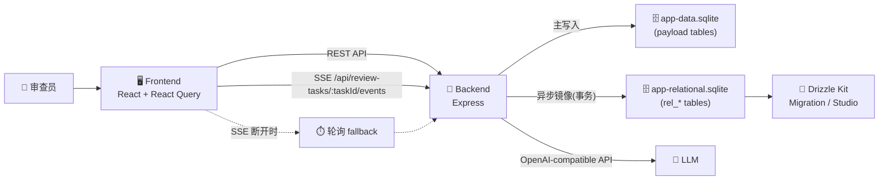

# Review Platform

## 1. 项目简介 Introduction
这是一个面向 B2B 场景的招投标文件智能审查系统，提供从文档上传、AI 审查到问题复核的端到端闭环能力。

## 2. 核心特性 Core Features
- ⚡ **基于 SSE 的实时流式审查体验**：任务详情页通过 `EventSource` 订阅 `/api/review-tasks/:taskId/events`，实时接收 `snapshot / task-updated / finding-created / heartbeat` 事件。
- 🛡️ **前后端共享的 Zod 强类型防线**：SSE 协议定义在 `shared/types/sse.ts`，服务端发送前校验、前端接收后再次校验，保证流式协议端到端一致。
- 🚀 **React 虚拟长列表性能优化**：问题列表在数据量达到阈值时自动切换到 `@tanstack/react-virtual`，降低大列表渲染与滚动开销。
- 💾 **本地草稿防丢机制**：复核备注支持 `localStorage` 草稿自动保存、7 天/50 条垃圾回收、`beforeunload` 提示与路由离开拦截。
- 🎯 **Fail-Fast 审查链路**：AI 依赖缺失时任务创建直接失败，不走本地规则降级，避免“看似成功但结果不可信”的假阳性流程。

## 3. 技术栈 Tech Stack
### 前端 Frontend
- `React 18` + `Vite` + `TypeScript`
- `React Router`、`@tanstack/react-query`
- `Tailwind CSS` + `Radix UI`（shadcn 风格组件）
- `@tanstack/react-virtual`（长列表虚拟化）

### 后端 Backend
- `Node.js` + `Express` + `TypeScript`
- `multer`（上传）、`dotenv`（环境变量）
- SSE 实时推送（任务与问题流）

### 共享层 Shared
- `shared/types/*`：前后端共用领域模型、API 类型与 SSE 协议
- `Zod`：统一运行时校验与类型推断

### 数据库 Database
- 主存储：`SQLite`（`node:sqlite`，WAL 模式）
- 关系镜像与迁移：`Drizzle ORM` + `drizzle-kit` + `SQLite`
- 迁移配置：`drizzle.config.ts`
- 关系镜像库：`server-data/app-relational.sqlite`

### AI 对接 AI Integration
- OpenAI 兼容接口（默认 `OPENAI_BASE_URL=https://api.openai.com/v1`）
- 默认模型：`gpt-4o-mini`

## 4. 架构设计 Architecture Highlights
- 🧭 **Fail-Fast 原则**：后端在关键依赖不满足时立即报错，阻断无效任务进入执行队列。
- 🔁 **SSE + 降级轮询**：前端优先使用 SSE；连接断开时自动回退为轮询拉取，恢复后继续实时流。
- 🧩 **同构类型设计**：前后端通过 `@shared/types` 共享协议与领域模型，减少“后端改了字段、前端无感”类回归。



## 5. 快速开始 Getting Started
### 5.1 安装依赖（前后端同仓）
```bash
npm install
```

### 5.2 配置环境变量
1. 复制环境变量模板：
```bash
cp .env.example .env
```
2. 至少配置：
- `OPENAI_API_KEY`
- `OPENAI_BASE_URL`（可选，默认已给出）
- `OPENAI_MODEL`（可选，默认 `gpt-4o-mini`）

可选性能/运行参数：
- `REVIEW_WORKER_CONCURRENCY`（默认 2）
- `PORT`（后端默认 8787）

### 5.3 数据库迁移（Drizzle + SQLite）
```bash
npm run db:generate
npm run db:push
```
非交互终端（如 CI）可使用：
```bash
npx drizzle-kit push --config=drizzle.config.ts --force
```

### 5.4 本地启动
后端：
```bash
npm run server:dev
```
前端（新终端）：
```bash
npm run dev
```

默认访问地址：
- Frontend: `http://localhost:8080`
- Backend: `http://localhost:8787`

## 6. 目录结构 Folder Structure
```text
.
├─ src/                 # 前端应用：页面、组件、hooks、查询层
├─ server/              # 后端服务：路由、业务服务、存储与流式推送
├─ shared/              # 前后端共享类型与协议（domain/api/sse）
├─ drizzle/             # Drizzle 生成的 SQL migration 与快照
├─ server-data/         # 本地 SQLite 数据文件
└─ storage/             # 上传文件落盘目录
```
